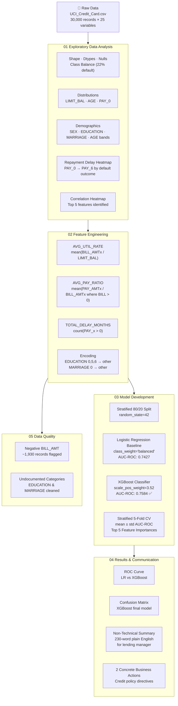

# Credit Default Risk Analysis
### Vitto — Data Science Intern Technical Assessment

End-to-end analysis of credit card default behaviour using the UCI Credit Card Default dataset (30,000 clients, Taiwan, 2005). The notebook identifies the strongest predictors of default, builds and compares classification models, and communicates findings to both technical and non-technical stakeholders.

---

## 🔄 Analysis Pipeline



---

## 📁 Repository Structure

```
├── credit_default_analysis.ipynb   # Main analysis notebook (run this)
├── UCI_Credit_Card.csv             # Dataset (30,000 records × 25 variables)
├── environment.yml                 # Conda environment definition
├── requirements.txt                # pip fallback
└── README.md
```

---

## ⚙️ Setup & Running

### Option 1 — Conda (Recommended)

```bash
conda env create -f environment.yml
conda activate vitto-credit
jupyter notebook credit_default_analysis.ipynb
```

### Option 2 — pip

```bash
pip install -r requirements.txt
jupyter notebook credit_default_analysis.ipynb
```

> **Python version:** 3.11  
> The notebook runs end-to-end without errors on a clean environment. All random operations use `RANDOM_STATE = 42` for full reproducibility.

---

## 📓 Notebook Structure

| Section | Contents |
|---------|----------|
| **00 Setup & Imports** | Constants, imports, global seaborn theme |
| **01 EDA** | Shape/dtypes/nulls/class balance · Distributions & anomaly flags · Default rates by demographics · Repayment delay heatmap · Correlation analysis |
| **02 Feature Engineering** | AVG_UTIL_RATE · AVG_PAY_RATIO · TOTAL_DELAY_MONTHS · EDUCATION & MARRIAGE encoding · Markdown justifications |
| **03 Model Development** | Logistic Regression baseline · XGBoost classifier · Stratified 5-fold CV · Top 5 feature importances |
| **04 Visualisation & Communication** | ROC curve · Confusion matrix · Non-technical summary · Two concrete business actions |
| **05 Data Quality & Edge Cases** | Undocumented EDUCATION/MARRIAGE values · Negative BILL_AMT handling |

---

## 📊 Key Results

| Metric | Logistic Regression | XGBoost (Final) |
|--------|--------------------:|----------------:|
| AUC-ROC (test) | 0.7427 | **0.7584** |
| Precision | 0.469 | 0.463 |
| Recall | 0.561 | **0.589** |
| F1-Score | 0.511 | **0.519** |
| CV AUC-ROC (mean ± std) | 0.757 ± 0.007 | **0.757 ± 0.009** |

### Top 5 Predictive Features (XGBoost)
1. `PAY_0` — most recent repayment status (Sep 2005)
2. `PAY_2` — repayment status Aug 2005
3. `PAY_3` — repayment status Jul 2005
4. `PAY_4` — repayment status Jun 2005
5. `PAY_5` — repayment status May 2005

> Consecutive repayment delay history dominates. Credit utilisation and repayment ratio features provide complementary signal.

---

## 💡 Business Recommendations

**Action 1 — Proactive Outreach**  
Automatically flag any borrower with `PAY_0 ≥ 2` (2+ months overdue on most recent bill) for proactive outreach and collections before their next statement is issued.

**Action 2 — Credit Limit Review**  
Trigger a credit limit review for any customer with `AVG_UTIL_RATE > 90%` and `AVG_PAY_RATIO < 10%` — this combination represents the highest-risk utilisation and repayment profile in the dataset.

---

## 🗂️ Dataset

**Source:** [UCI Machine Learning Repository — Default of Credit Card Clients](https://archive.ics.uci.edu/dataset/350/default+of+credit+card+clients)  
30,000 records · 25 variables · Taiwan, April–September 2005  
Default rate: ~22% (6,636 of 30,000 clients)

**Notable data quality issues handled:**
- `EDUCATION` undocumented values (0, 5, 6) → merged into 'other'
- `MARRIAGE` undocumented value (0) → merged into 'other'
- `PAY_x` value `-2` (no consumption) distinguished from actual delays
- Negative `BILL_AMT` values (~1,930 records) retained as valid overpayment signal

---

## 🛠️ Technical Decisions

- **Class imbalance (22%):** `class_weight='balanced'` for Logistic Regression; `scale_pos_weight ≈ 3.52` for XGBoost — avoids data leakage risk of SMOTE in cross-validation
- **Validation strategy:** Stratified 80/20 train/test split → 5-fold CV on training set → final evaluation on held-out test set
- **8 publication-quality plots** (requirement: minimum 5)
